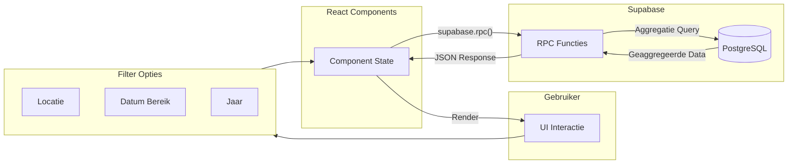
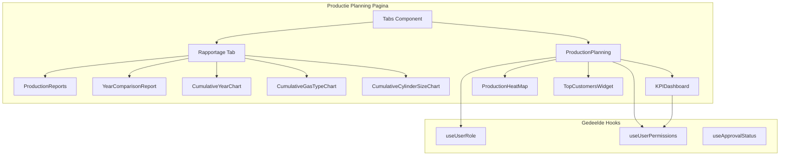

 # Database RPC Functies Documentatie
 
 Dit document bevat een overzicht van alle PostgreSQL RPC functies die beschikbaar zijn in de Supabase database en worden gebruikt in de frontend applicatie.

## Architectuur Diagram

```mermaid
flowchart TB
    subgraph Frontend["Frontend Componenten"]
        subgraph Planning["Productie Planning"]
            PP[ProductionPlanning]
            DP[DryIcePlanning]
            GP[GasCylinderPlanning]
        end
        
        subgraph Reports["Rapportage"]
            PR[ProductionReports]
            YCR[YearComparisonReport]
            CYC[CumulativeYearChart]
            CGTC[CumulativeGasTypeChart]
            CSC[CumulativeCylinderSizeChart]
        end
        
        subgraph Analytics["Analytics"]
            KPI[KPIDashboard]
            PHM[ProductionHeatMap]
            TCW[TopCustomersWidget]
            CS[CustomerSegmentation]
        end
        
        subgraph Auth["Authenticatie"]
            AH[Auth Hooks]
            RLS[RLS Policies]
        end
    end
    
    subgraph RPC["Database RPC Functies"]
        subgraph Efficiency["Efficiency Stats"]
            GPE[get_production_efficiency]
            GPEP[get_production_efficiency_by_period]
            GDIEP[get_dry_ice_efficiency_by_period]
        end
        
        subgraph Daily["Dagelijkse Productie"]
            GDPBP[get_daily_production_by_period]
            GDPT[get_daily_production_totals]
        end
        
        subgraph Monthly["Maandelijkse Aggregatie"]
            GMOT[get_monthly_order_totals]
            GMCTGT[get_monthly_cylinder_totals_by_gas_type]
            GMCTS[get_monthly_cylinder_totals_by_size]
            GMCTC[get_monthly_cylinder_totals_by_customer]
        end
        
        subgraph Customer["Klant Analytics"]
            GYTC[get_yearly_totals_by_customer]
            GCTBP[get_customer_totals_by_period]
            GCS[get_customer_segments]
            GGTDBP[get_gas_type_distribution_by_period]
        end
        
        subgraph AuthRPC["Auth Functies"]
            GUR[get_user_role]
            GUPL[get_user_production_location]
            HR[has_role]
            HER[has_elevated_role]
            IA[is_admin]
            IUA[is_user_approved]
        end
        
        subgraph Admin["Admin"]
            BDOY[bulk_delete_orders_by_year]
        end
    end
    
    %% Efficiency connections
    KPI --> GPE
    KPI --> GPEP
    PP --> GPEP
    PR --> GPEP
    PP --> GDIEP
    PR --> GDIEP
    
    %% Daily production connections
    PR --> GDPBP
    PHM --> GDPT
    
    %% Monthly aggregation connections
    CYC --> GMOT
    YCR --> GMOT
    CGTC --> GMCTGT
    YCR --> GMCTGT
    YCR --> GMCTS
    CSC --> GMCTS
    YCR --> GMCTC
    
    %% Customer analytics connections
    TCW --> GYTC
    YCR --> GYTC
    TCW --> GCTBP
    PR --> GCTBP
    CS --> GCS
    PR --> GGTDBP
    
    %% Auth connections
    AH --> GUR
    AH --> GUPL
    AH --> IUA
    RLS --> HR
    RLS --> HER
    RLS --> IA
    
    %% Styling
    classDef planning fill:#f97316,stroke:#ea580c,color:#fff
    classDef reports fill:#3b82f6,stroke:#2563eb,color:#fff
    classDef analytics fill:#10b981,stroke:#059669,color:#fff
    classDef auth fill:#8b5cf6,stroke:#7c3aed,color:#fff
    classDef rpc fill:#64748b,stroke:#475569,color:#fff
    
    class PP,DP,GP planning
    class PR,YCR,CYC,CGTC,CSC reports
    class KPI,PHM,TCW,CS analytics
    class AH,RLS auth
```



## Data Flow Diagram



## Component Dependencies


 
 ## Overzicht
 
 | Functie | Doel | Gebruikt In |
 |---------|------|-------------|
 | `get_production_efficiency` | Jaarlijkse productie efficiency stats | KPIDashboard |
 | `get_production_efficiency_by_period` | Periode-gebaseerde efficiency stats | ProductionPlanning, ProductionReports, KPIDashboard |
 | `get_dry_ice_efficiency_by_period` | Droogijs efficiency voor periode | ProductionPlanning, ProductionReports |
 | `get_daily_production_by_period` | Dagelijkse productie voor grafieken | ProductionReports |
 | `get_daily_production_totals` | Dagelijkse totalen per maand | ProductionHeatMap |
 | `get_gas_type_distribution_by_period` | Gastype verdeling per periode | ProductionReports |
 | `get_monthly_order_totals` | Maandelijkse order totalen | CumulativeYearChart, YearComparisonReport |
 | `get_monthly_cylinder_totals_by_gas_type` | Maandelijkse cilinders per gastype | CumulativeGasTypeChart, YearComparisonReport |
 | `get_monthly_cylinder_totals_by_size` | Maandelijkse cilinders per grootte | YearComparisonReport |
 | `get_monthly_cylinder_totals_by_customer` | Maandelijkse cilinders per klant | YearComparisonReport |
 | `get_yearly_totals_by_customer` | Jaarlijkse totalen per klant | TopCustomersWidget, YearComparisonReport |
 | `get_customer_totals_by_period` | Klant totalen voor periode | TopCustomersWidget |
| `get_customer_segments` | Klantsegmentatie analyse | CustomerSegmentation, ProductionReports |
 | `bulk_delete_orders_by_year` | Bulk verwijdering orders | Admin functies |
 | `get_user_role` | Gebruikersrol ophalen | Auth hooks |
 | `get_user_production_location` | Gebruiker productielocatie | Auth hooks |
 | `has_role` | Rol check | RLS policies |
 | `has_elevated_role` | Admin/Supervisor check | RLS policies |
 | `is_admin` | Admin check | RLS policies |
 | `is_user_approved` | Goedkeuring status | Auth hooks |
 
 ---
 
 ## Productie Efficiency Functies
 
 ### `get_production_efficiency`
 
 Berekent jaarlijkse efficiency statistieken voor gascilinder orders.
 
 **Parameters:**
 | Parameter | Type | Beschrijving |
 |-----------|------|--------------|
 | `p_year` | integer | Het jaar waarvoor stats worden berekend |
 | `p_location` | text (optional) | Productielocatie filter (`sol_emmen`, `sol_tilburg`, of `null` voor alle) |
 
 **Returns:**
 ```typescript
 {
   total_orders: number;
   completed_orders: number;
   pending_orders: number;
   cancelled_orders: number;
   efficiency_rate: number;      // Percentage voltooid
   total_cylinders: number;
   completed_cylinders: number;
 }
 ```
 
 **Gebruikt in:** `KPIDashboard.tsx` (jaar modus)
 
 ---
 
 ### `get_production_efficiency_by_period`
 
 Berekent efficiency statistieken voor gascilinder orders binnen een datumbereik.
 
 **Parameters:**
 | Parameter | Type | Beschrijving |
 |-----------|------|--------------|
 | `p_from_date` | date | Start datum (YYYY-MM-DD) |
 | `p_to_date` | date | Eind datum (YYYY-MM-DD) |
 | `p_location` | text (optional) | Productielocatie filter |
 
 **Returns:**
 ```typescript
 {
   total_orders: number;
   completed_orders: number;
   pending_orders: number;
   cancelled_orders: number;
   efficiency_rate: number;
   total_cylinders: number;
   completed_cylinders: number;
 }
 ```
 
 **Gebruikt in:** `ProductionPlanning.tsx`, `ProductionReports.tsx`, `KPIDashboard.tsx`
 
 ---
 
 ### `get_dry_ice_efficiency_by_period`
 
 Berekent efficiency statistieken voor droogijs orders binnen een datumbereik.
 
 **Parameters:**
 | Parameter | Type | Beschrijving |
 |-----------|------|--------------|
 | `p_from_date` | date | Start datum (YYYY-MM-DD) |
 | `p_to_date` | date | Eind datum (YYYY-MM-DD) |
 | `p_location` | text (optional) | Productielocatie filter (meestal `null` voor droogijs) |
 
 **Returns:**
 ```typescript
 {
   total_orders: number;
   completed_orders: number;
   pending_orders: number;
   cancelled_orders: number;
   efficiency_rate: number;
   total_kg: number;           // Totaal kg droogijs
   completed_kg: number;       // Voltooide kg droogijs
 }
 ```
 
 **Gebruikt in:** `ProductionPlanning.tsx`, `ProductionReports.tsx`
 
 ---
 
 ## Dagelijkse Productie Functies
 
 ### `get_daily_production_by_period`
 
 Haalt dagelijkse productie totalen op voor grafieken.
 
 **Parameters:**
 | Parameter | Type | Beschrijving |
 |-----------|------|--------------|
 | `p_from_date` | date | Start datum |
 | `p_to_date` | date | Eind datum |
 | `p_location` | text (optional) | Productielocatie filter |
 
 **Returns:**
 ```typescript
 {
   production_date: string;    // YYYY-MM-DD
   cylinder_count: number;     // Aantal cilinders
   dry_ice_kg: number;         // Kg droogijs
 }[]
 ```
 
 **Gebruikt in:** `ProductionReports.tsx` (dagelijkse grafiek)
 
 ---
 
 ### `get_daily_production_totals`
 
 Haalt dagelijkse totalen op voor een specifieke maand (heatmap).
 
 **Parameters:**
 | Parameter | Type | Beschrijving |
 |-----------|------|--------------|
 | `p_year` | integer | Het jaar |
 | `p_month` | integer (optional) | De maand (1-12) |
 | `p_location` | text (optional) | Productielocatie filter |
 
 **Returns:**
 ```typescript
 {
   production_date: string;
   cylinder_count: number;
   dry_ice_kg: number;
 }[]
 ```
 
 **Gebruikt in:** `ProductionHeatMap.tsx`
 
 ---
 
 ## Gastype Functies
 
 ### `get_gas_type_distribution_by_period`
 
 Berekent de verdeling van cilinders per gastype voor een periode.
 
 **Parameters:**
 | Parameter | Type | Beschrijving |
 |-----------|------|--------------|
 | `p_from_date` | date | Start datum |
 | `p_to_date` | date | Eind datum |
 | `p_location` | text (optional) | Productielocatie filter |
 
 **Returns:**
 ```typescript
 {
   gas_type_id: string | null;
   gas_type_name: string;
   gas_type_color: string;
   total_cylinders: number;
 }[]
 ```
 
 **Gebruikt in:** `ProductionReports.tsx` (pie chart)
 
 ---
 
 ### `get_monthly_cylinder_totals_by_gas_type`
 
 Haalt maandelijkse cilinder totalen per gastype op.
 
 **Parameters:**
 | Parameter | Type | Beschrijving |
 |-----------|------|--------------|
 | `p_year` | integer | Het jaar |
 | `p_location` | text (optional) | Productielocatie filter |
 
 **Returns:**
 ```typescript
 {
   month: number;              // 1-12
   gas_type_id: string;
   gas_type_name: string;
   gas_type_color: string;
   total_cylinders: number;
 }[]
 ```
 
 **Gebruikt in:** `CumulativeGasTypeChart.tsx`, `YearComparisonReport.tsx`
 
 ---
 
 ## Klant Functies
 
 ### `get_yearly_totals_by_customer`
 
 Berekent jaarlijkse totalen per klant.
 
 **Parameters:**
 | Parameter | Type | Beschrijving |
 |-----------|------|--------------|
 | `p_year` | integer | Het jaar |
 | `p_location` | text (optional) | Productielocatie filter |
 
 **Returns:**
 ```typescript
 {
   customer_id: string;
   customer_name: string;
   total_cylinders: number;
   total_dry_ice_kg: number;
 }[]
 ```
 
 **Gebruikt in:** `TopCustomersWidget.tsx` (jaar modus), `YearComparisonReport.tsx`
 
 ---
 
 ### `get_customer_totals_by_period`
 
 Berekent klant totalen voor een specifieke periode.
 
 **Parameters:**
 | Parameter | Type | Beschrijving |
 |-----------|------|--------------|
 | `p_from_date` | date | Start datum |
 | `p_to_date` | date | Eind datum |
 | `p_location` | text (optional) | Productielocatie filter |
 
 **Returns:**
 ```typescript
 {
   customer_id: string;
   customer_name: string;
   total_cylinders: number;
   total_dry_ice_kg: number;
 }[]
 ```
 
**Gebruikt in:** `TopCustomersWidget.tsx` (periode modus), `ProductionReports.tsx` (klantranglijst)
 
 ---
 
 ### `get_monthly_cylinder_totals_by_customer`
 
 Haalt maandelijkse cilinder totalen per klant op.
 
 **Parameters:**
 | Parameter | Type | Beschrijving |
 |-----------|------|--------------|
 | `p_year` | integer | Het jaar |
 | `p_location` | text (optional) | Productielocatie filter |
 
 **Returns:**
 ```typescript
 {
   month: number;
   customer_id: string;
   customer_name: string;
   total_cylinders: number;
 }[]
 ```
 
 **Gebruikt in:** `YearComparisonReport.tsx`
 
 ---
 
 ### `get_customer_segments`
 
 Analyseert klantsegmenten op basis van ordergeschiedenis.
 
 **Parameters:**
 | Parameter | Type | Beschrijving |
 |-----------|------|--------------|
 | `p_year` | integer | Het jaar |
 | `p_location` | text (optional) | Productielocatie filter |
 
 **Returns:**
 ```typescript
 {
   customer_id: string;
   customer_name: string;
   order_count: number;
   total_cylinders: number;
   total_dry_ice_kg: number;
   avg_order_size: number;
   first_order_date: string;
   last_order_date: string;
   tier: string;               // "platinum", "gold", "silver", "bronze"
   trend: string;              // "growing", "stable", "declining"
 }[]
 ```
 
 **Gebruikt in:** `CustomerSegmentation.tsx`
 
 ---
 
 ## Maandelijkse Aggregatie Functies
 
 ### `get_monthly_order_totals`
 
 Haalt maandelijkse order totalen op per type.
 
 **Parameters:**
 | Parameter | Type | Beschrijving |
 |-----------|------|--------------|
 | `p_year` | integer | Het jaar |
 | `p_order_type` | string | `"cylinder"` of `"dry_ice"` |
 | `p_location` | text (optional) | Productielocatie filter |
 
 **Returns:**
 ```typescript
 {
   month: number;              // 1-12
   total_value: number;        // Cilinders of kg
 }[]
 ```
 
 **Gebruikt in:** `CumulativeYearChart.tsx`, `YearComparisonReport.tsx`
 
 ---
 
 ### `get_monthly_cylinder_totals_by_size`
 
 Haalt maandelijkse cilinder totalen per cilindergrootte op.
 
 **Parameters:**
 | Parameter | Type | Beschrijving |
 |-----------|------|--------------|
 | `p_year` | integer | Het jaar |
 | `p_location` | text (optional) | Productielocatie filter |
 
 **Returns:**
 ```typescript
 {
   month: number;
   cylinder_size: string;
   total_cylinders: number;
 }[]
 ```
 
 **Gebruikt in:** `YearComparisonReport.tsx`
 
 ---
 
 ## Admin Functies
 
 ### `bulk_delete_orders_by_year`
 
 Verwijdert orders in bulk voor een specifiek jaar.
 
 **Parameters:**
 | Parameter | Type | Beschrijving |
 |-----------|------|--------------|
 | `p_order_type` | string | `"cylinder"` of `"dry_ice"` |
 | `p_year` | integer | Het jaar |
 
 **Returns:** `number` - Aantal verwijderde records
 
 ---
 
 ## Authenticatie Functies
 
 ### `get_user_role`
 
 Haalt de rol van een gebruiker op.
 
 **Parameters:**
 | Parameter | Type | Beschrijving |
 |-----------|------|--------------|
 | `_user_id` | uuid | Gebruiker ID |
 
 **Returns:** `string` - Rol (`"admin"`, `"supervisor"`, `"operator"`, `"user"`)
 
 ---
 
 ### `get_user_production_location`
 
 Haalt de productielocatie van een gebruiker op.
 
 **Parameters:**
 | Parameter | Type | Beschrijving |
 |-----------|------|--------------|
 | `_user_id` | uuid | Gebruiker ID |
 
 **Returns:** `production_location` enum
 
 ---
 
 ### `has_role`
 
 Controleert of een gebruiker een specifieke rol heeft.
 
 **Parameters:**
 | Parameter | Type | Beschrijving |
 |-----------|------|--------------|
 | `_user_id` | uuid | Gebruiker ID |
 | `_role` | app_role | De te controleren rol |
 
 **Returns:** `boolean`
 
 ---
 
 ### `has_elevated_role`
 
 Controleert of een gebruiker een verhoogde rol heeft (admin of supervisor).
 
 **Parameters:**
 | Parameter | Type | Beschrijving |
 |-----------|------|--------------|
 | `_user_id` | uuid | Gebruiker ID |
 
 **Returns:** `boolean`
 
 ---
 
 ### `is_admin`
 
 Controleert of de huidige gebruiker admin is.
 
 **Parameters:** Geen (gebruikt `auth.uid()`)
 
 **Returns:** `boolean`
 
 ---
 
 ### `is_user_approved`
 
 Controleert of de huidige gebruiker goedgekeurd is.
 
 **Parameters:** Geen (gebruikt `auth.uid()`)
 
 **Returns:** `boolean`
 
 ---
 
 ## Performance Notities
 
 - Alle aggregatie RPC functies zijn geïmplementeerd om de **1.000 rij limiet** van Supabase te omzeilen
 - Server-side aggregatie is **significant sneller** dan client-side berekeningen
 - Functies met `p_location` parameter ondersteunen `null` voor "alle locaties"
 - Datum parameters gebruiken het `YYYY-MM-DD` formaat
 
 ## Voorbeeld Gebruik
 
 ```typescript
 // Parallelle RPC calls voor optimale performance
 const [efficiencyRes, customersRes] = await Promise.all([
   supabase.rpc("get_production_efficiency_by_period", {
     p_from_date: "2025-01-01",
     p_to_date: "2025-12-31",
     p_location: "sol_emmen"
   }),
   supabase.rpc("get_customer_totals_by_period", {
     p_from_date: "2025-01-01",
     p_to_date: "2025-12-31",
     p_location: null // Alle locaties
   })
 ]);
 
 if (efficiencyRes.error) {
   console.error("RPC error:", efficiencyRes.error);
   return;
 }
 
 const stats = efficiencyRes.data?.[0];
 console.log("Efficiency:", stats?.efficiency_rate, "%");
 ```